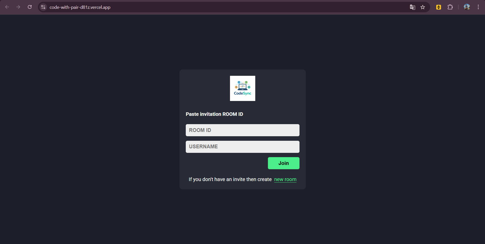
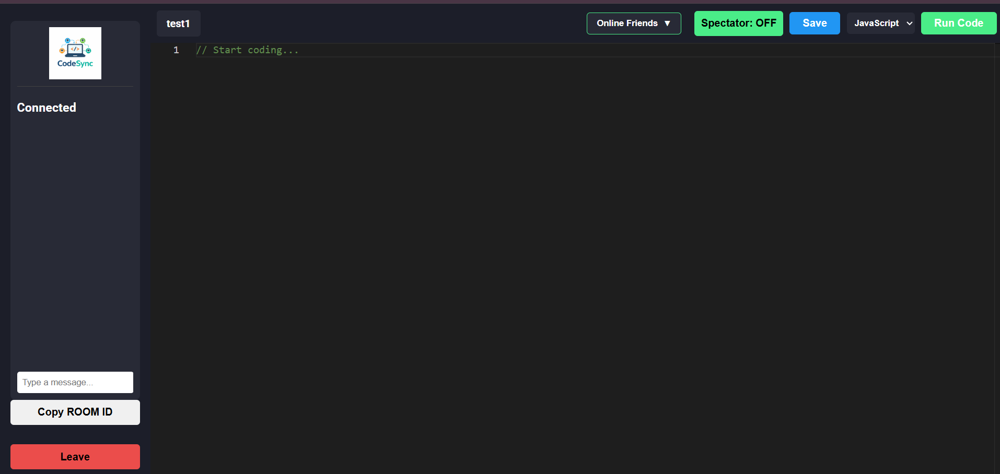
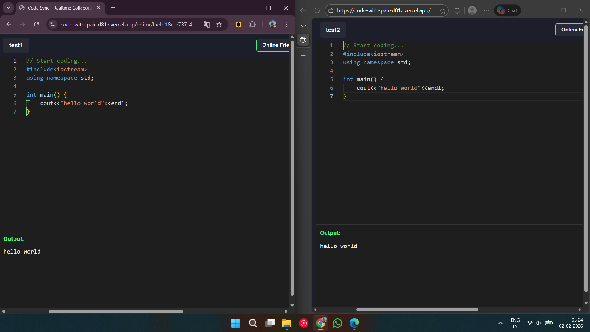
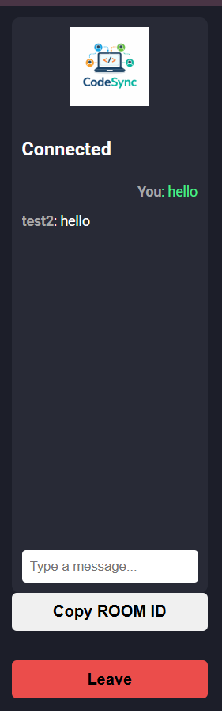

# 🚀 CodeWithPair

A **real-time collaborative code editor** that allows multiple developers to code together simultaneously. Built with React, Node.js, Socket.IO, and Monaco Editor.

[]([YOUR_DEPLOYED_URL_HERE](https://code-with-pair-d81z.vercel.app/))
[](https://nodejs.org/)
[](https://reactjs.org/)
[](https://socket.io/)

---

## 🌐 Live Demo

👉 **[Click here to try the app]([YOUR_DEPLOYED_URL_HERE](https://code-with-pair-d81z.vercel.app/))**

---

## 📸 Screenshots

<!-- Add your screenshots here -->
<!-- Replace the placeholder paths with actual screenshot paths -->

### Home Page


### Code Editor Room


### Real-time Collaboration


### Chat Feature


---

## ✨ Features

- 🔄 **Real-time Code Sync** - Code changes are instantly reflected across all connected users
- 🧑‍🤝‍🧑 **Room-based Collaboration** - Create or join rooms with unique Room IDs
- 💬 **In-room Chat** - Communicate with teammates without leaving the editor
- 🎨 **Multiple Language Support** - JavaScript, Python, and C++ with syntax highlighting
- ▶️ **Code Execution** - Run your code directly in the browser using Piston API
- 💾 **Cloud Save** - Save your code to MongoDB for persistence
- 📥 **Download Code** - Download your code files with proper extensions
- 👀 **Spectator Mode** - Toggle read-only mode to observe without editing
- 🟢 **Online Users** - See who's currently in your room

---

## 🛠️ Tech Stack

### Frontend
- **React 18** - UI Library
- **Vite** - Build Tool
- **Monaco Editor** - Code Editor (VS Code's editor)
- **Socket.IO Client** - Real-time communication
- **React Router** - Navigation
- **React Hot Toast** - Notifications
- **Axios** - HTTP client

### Backend
- **Node.js** - Runtime
- **Express** - Web framework
- **Socket.IO** - Real-time bidirectional communication
- **MongoDB + Mongoose** - Database for code persistence
- **dotenv** - Environment variables

---

## 🚀 Getting Started

### Prerequisites

- Node.js 18+ installed
- MongoDB Atlas account or local MongoDB instance
- Git

### Installation

1. **Clone the repository**
   ```bash
   git clone https://github.com/YOUR_USERNAME/CodeWithPair.git
   cd CodeWithPair
   ```

2. **Install server dependencies**
   ```bash
   cd server
   npm install
   ```

3. **Install client dependencies**
   ```bash
   cd ../client
   npm install
   ```

4. **Configure environment variables**

   Create a `.env` file in the `server` directory:
   ```env
   PORT=5000
   MONGO_URI=your_mongodb_connection_string
   ```

   Create a `.env` file in the `client` directory:
   ```env
   VITE_BACKEND_URL=http://localhost:5000
   ```

5. **Run the development servers**

   In one terminal (server):
   ```bash
   cd server
   npm run dev
   ```

   In another terminal (client):
   ```bash
   cd client
   npm run dev
   ```

6. **Open your browser**
   
   Navigate to `http://localhost:5173`

---

## 📁 Project Structure

```
CodeWithPair/
├── client/                 # React frontend
│   ├── src/
│   │   ├── components/     # Reusable components
│   │   │   ├── Chat.jsx
│   │   │   ├── Client.jsx
│   │   │   └── Editor.jsx
│   │   ├── pages/          # Page components
│   │   │   ├── Home.jsx
│   │   │   └── EditorPage.jsx
│   │   ├── Actions.js      # Socket action constants
│   │   ├── socket.js       # Socket initialization
│   │   ├── App.jsx
│   │   └── main.jsx
│   └── package.json
│
├── server/                 # Node.js backend
│   ├── models/             # Mongoose models
│   │   └── CodeSession.js
│   ├── Actions.js          # Socket action constants
│   ├── index.js            # Server entry point
│   └── package.json
│
└── README.md
```

---

## 🔌 API Endpoints

| Method | Endpoint | Description |
|--------|----------|-------------|
| POST | `/api/save` | Save code to database |

---

## 🔧 Socket Events

| Event | Description |
|-------|-------------|
| `join` | User joins a room |
| `joined` | Broadcast when user joins |
| `disconnected` | User leaves room |
| `code-change` | Code update broadcast |
| `sync-code` | Sync code with new users |
| `send-message` | Send chat message |
| `receive-message` | Receive chat message |
| `language-change` | Language selection changed |
| `sync-output` | Sync code execution output |
| `sync-save` | Trigger save for all users |

---

## 🚢 Deployment

### Deploy Backend (e.g., Render, Railway, Heroku)

1. Push your code to GitHub
2. Connect your repository to your hosting platform
3. Set environment variables:
   - `PORT`
   - `MONGO_URI`
4. Build command: `npm install`
5. Start command: `npm start`

### Deploy Frontend (e.g., Vercel, Netlify)

1. Connect your repository
2. Set build directory to `client`
3. Build command: `npm run build`
4. Output directory: `dist`
5. Set environment variable:
   - `VITE_BACKEND_URL=your_backend_url`

---

## 🤝 Contributing

Contributions are welcome! Please feel free to submit a Pull Request.

1. Fork the project
2. Create your feature branch (`git checkout -b feature/AmazingFeature`)
3. Commit your changes (`git commit -m 'Add some AmazingFeature'`)
4. Push to the branch (`git push origin feature/AmazingFeature`)
5. Open a Pull Request

---

## 📝 License

This project is open source and available under the [MIT License](LICENSE).

---

## 👨‍💻 Author

**Sajal Rastogi**

- GitHub: [@Sajalrastogi191](https://github.com/Sajalrastogi191)

---

## ⭐ Show your support

Give a ⭐️ if this project helped you!

---

<p align="center">Made with ❤️ for developers who love to collaborate</p>

